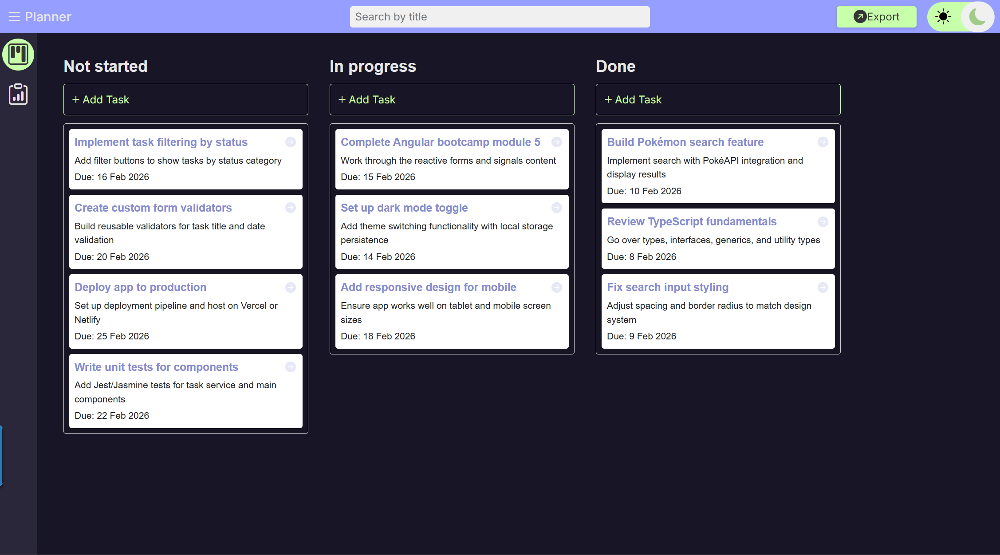
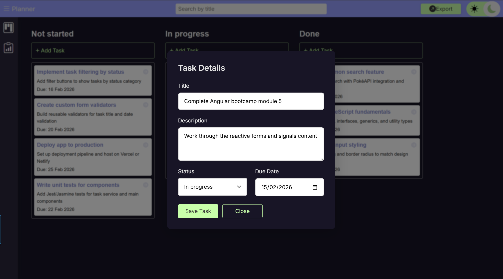
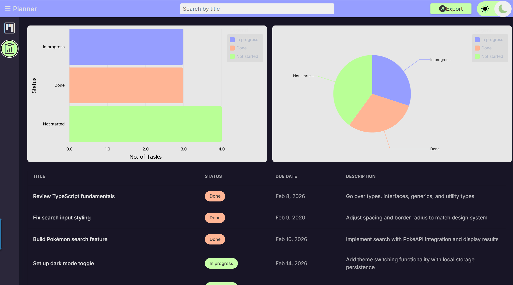

# Planner

A modern, feature-rich task management application built with Angular 21, featuring drag-and-drop functionality, real-time analytics, and a clean, responsive UI.



## Features

### 📋 Task Board

- **Drag & Drop Interface**: Intuitive task management with three status columns (Not started, In progress, Done)
- **Real-time Updates**: Tasks update instantly as you drag them between columns
- **Task Search**: Filter tasks by title with real-time search
- **Task Details**: Comprehensive task information including title, description, due date, and status



### 📊 Analytics Dashboard

- **Visual Insights**: Interactive charts showing task distribution by status
- **Multiple Chart Types**: Horizontal bar chart and pie chart visualizations
- **Task Table**: Sortable table view of all tasks with due date sorting
- **Status Overview**: Quick glance at project progress



### 🎨 User Experience

- **Responsive Design**: Basic mobile layout (tablet/mobile optimization in progress)
- **Theme Support**: Built-in light/dark mode toggle with local storage persistence
- **Notifications**: Toast notifications for user actions and updates
- **Modern UI**: Clean, professional interface with smooth animations

### 🔧 Additional Features

- **CSV Export**: Export all tasks to CSV format for external use
- **Task Filtering**: Filter tasks by status or search term
- **Form Validation**: Robust validation for task creation and editing
- **Route Management**: Clean URL structure with query parameters

## Tech Stack

- **Framework**: Angular 21 (Standalone Components)
- **State Management**: Angular Signals
- **Drag & Drop**: Angular CDK
- **Charts**: ngx-charts (@swimlane/ngx-charts)
- **Styling**: CSS3 with CSS Variables for theming
- **Reactive Programming**: RxJS
- **Type Safety**: TypeScript

## Prerequisites

- Node.js (v18 or higher)
- npm or yarn
- Angular CLI (`npm install -g @angular/cli`)

## Installation

1. Clone the repository:

```bash
git clone <repository-url>
cd task-management-board
```

2. Install dependencies:

```bash
npm install
```

3. Start the development server:

```bash
ng serve
```

4. Open your browser and navigate to `http://localhost:4200`

## Project Structure

```
src/
├── app/
│   ├── components/
│   │   ├── task-card/         # Individual task display
│   │   ├── task-form/         # Task creation/editing form
│   │   ├── sidebar/           # Navigation sidebar
│   │   ├── header/            # Application header
│   │   ├── notification/      # Toast notifications
│   │   └── ui/
│   │       └── button/        # Reusable button component
│   ├── pages/
│   │   ├── home/              # Main task board view
│   │   └── analytics/         # Analytics dashboard
│   ├── service/
│   │   ├── task-service.ts    # Task management service
│   │   ├── notifications.ts   # Notification service
│   │   └── export.ts          # CSV export service
│   ├── app.component.ts       # Root component
│   ├── app.routes.ts          # Application routes
│   └── material-theme.scss    # Material Design theme
```

## Usage

### Managing Tasks

**Add a Task:**

1. Click the "Add Task" button in any status column
2. Fill in the task details (title, description, due date)
3. Click "Save" to create the task

**Move Tasks:**

- Simply drag and drop tasks between the three status columns
- Tasks automatically update their status when moved

**Search Tasks:**

- Use the search bar to filter tasks by title
- Search is case-insensitive and updates in real-time

### Viewing Analytics

1. Navigate to the Analytics page using the sidebar
2. View task distribution through interactive charts
3. Review all tasks in the sortable table view

### Exporting Data

- Use the export functionality to download all tasks as a CSV file
- File includes: ID, Title, Status, Description, Due Date, Created At

## Key Services

### TaskService

Manages all task-related operations using Angular signals:

- `tasks`: Read-only signal of all tasks
- `tasksArray`: Computed array of tasks
- `filterTasks`: Computed filtered tasks based on search
- `addOrUpdateTasks()`: Add or update tasks
- `updateTaskStatus()`: Update task status when dragging

### NotificationService

Handles toast notifications:

- `show()`: Display notification (success, error, info)
- `hide()`: Dismiss notification
- Auto-dismiss after 3 seconds

### Export

CSV export functionality:

- `generateCSV()`: Generate and download CSV file
- Proper CSV escaping for special characters

## Development

### Available Scripts

- `ng serve` - Start development server
- `ng build` - Build for production
- `ng test` - Run unit tests
- `ng lint` - Lint the codebase

### Building for Production

```bash
ng build --configuration production
```

The build artifacts will be stored in the `dist/` directory.

## Responsive Design

The application has basic responsive design implemented:

- **Desktop**: Full three-column layout
- **Mobile**: Stacked column layout
- **Note**: Full responsiveness needs work and optimization for all screen sizes

## Browser Support

- Chrome (latest)
- Firefox (latest)
- Safari (latest)
- Edge (latest)

## Future Enhancements

- [ ] Improve responsive design for tablet and mobile devices
- [ ] Task priority levels
- [ ] Task categories/tags
- [ ] Due date reminders
- [ ] Task comments
- [ ] User authentication
- [ ] Team collaboration features
- [ ] Advanced filtering options
- [ ] Export to PDF
- [ ] Task archiving
- [ ] Keyboard shortcuts

## Contributing

Contributions are welcome! Please feel free to submit a Pull Request.

## License

This project is licensed under the MIT License.

## Acknowledgments

- Angular team for the amazing framework
- ngx-charts for data visualization
- Angular CDK for drag-and-drop functionality
